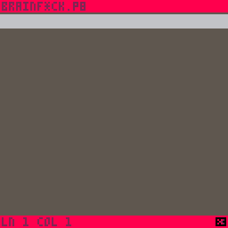
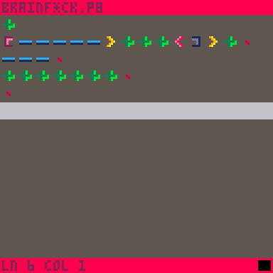
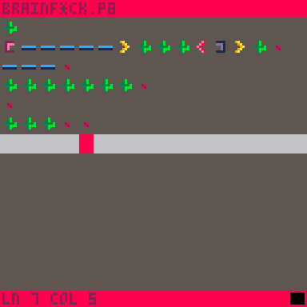
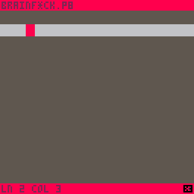
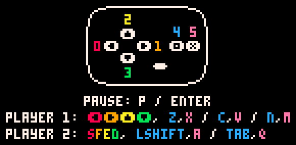

# PicoBrained

A small, configurable brainf*ck code editor, interpreter and visualiser, while only using the default Pico8 scheme.

Use it on [lexaloffle](https://www.lexaloffle.com/bbs/?tid=149466)!

# Picobrained is a...

## Code editor

## Code interpreter

## Code visualiser

## Configurable code editor

And yes, the configuration persists, even if you reset the console!

# Clipboard
The editor fully supports pasing and copying to your clipboard.
The catch is that the Pico8 needs you to press Ctrl+V while the console is focused to have access to your latest clipboard entry.

So, when copying code from an outside source, make sure to press Ctrl+V while the console is focused before pressing "Paste Clip" in the menu.

# Controls

Move the cursor with the DPad.

While holding the O buttons:
    Press Left/Right to switch the BrainF*ck tokens.
    Press Down to bring down the menu.

Press X to place down a token.

# LICENSE
GPL 3.0
